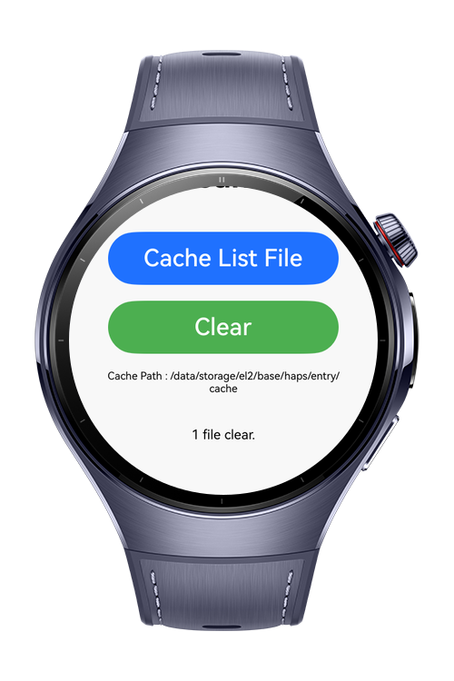

# ClearWatch

**What's New in the Scenario Expansion**
- **Background Performance Auditor**: Automated system health checks using `@kit.BackgroundTasksKit`.
- **Intelligent Notifications**: Proactive alerts for high resource usage via `@kit.NotificationKit`.
- **24-Hour Performance History**: Persistence of CPU and memory metrics using `@kit.ArkData`.
- **Shake-to-Clean Gesture**: Wrist-shake based cache optimization powered by `@kit.SensorServiceKit`.
- **Enhanced Data Layer**: Preferences-based storage for user settings and historical snapshots.

---

> **Note:** To access all shared projects, get information about environment setup, and view other guides, please visit [Explore-In-HMOS-Wearable Index](https://github.com/Explore-In-HMOS-Wearable/hmos-index).

The ClearWatch app provides real-time CPU performance monitoring along with the ability to scan and clean application
cache files on HarmonyOS wearable devices.
The purpose is to help users optimize system performance, free storage, and visualize CPU activity through intuitive
charts.

# Preview

<div>


  
  

</div>


# Use Cases
With this application, you can access the clock's memory usage and CPU values. You can see them visually with a graph. On the last page, you can access and clear the catches within the application.

# Tech Stack

- **Languages**: ArkTS, ArkUI
- **Frameworks**: HarmonyOS 5.1.0(18)
- **Tools**: DevEco Studio Vers 5.1.0.828SP1,
- **Libraries**: @kit.ArkUI, @kit.AbilityKit,@kit.PerformanceAnalysisKit,@visactor/harmony-vchart,@ohos/lottie,@kit.ArkData,@kit.BackgroundTasksKit,@kit.NotificationKit,@kit.SensorServiceKit

# Directory Structure

```
├───common
│       animation.json
│
├───entryability
│       EntryAbility.ets
│
├───entrybackupability
│       EntryBackupAbility.ets
│
├───model
│       Cpu.ets
│
├───pages
│       ClearWatch.ets
│       Dashboard.ets
│       Graph.ets
│       HistoryPage.ets
│       Index.ets
│       SplashScreen.ets
│
├───service
│       BackgroundMonitorService.ets
│       FileCleanerService.ets
│
├───util
│       CpuHelper.ets
│       GestureHelper.ets
│       PreferenceManager.ets
│
└───viewmodel
        ClearWatchViewModel.ets
        CpuViewModel.ets
        HistoryViewModel.ets

```

# Constraints and Restrictions

## Suported Devices

- Huawei Watch 5

## Limitations

- ClearWatch is not working on previewer or simulators

# License

**ClearWatch** is distributed under the terms of the MIT License
See the [LICENSE](./LICENSE) for more information.
