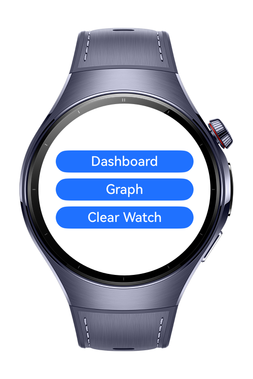
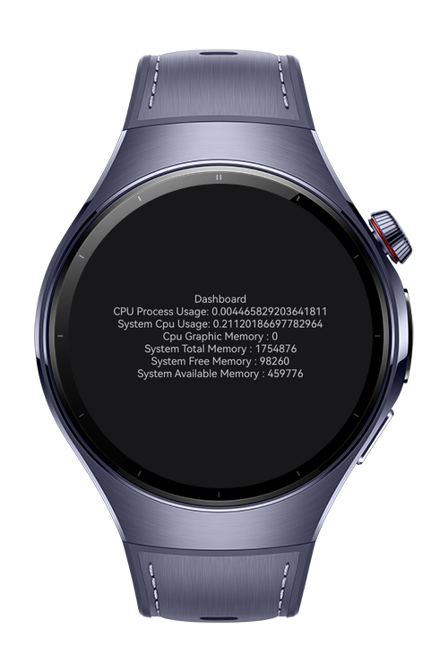
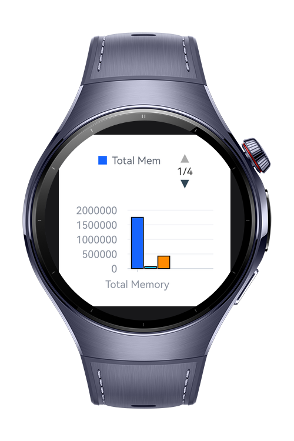
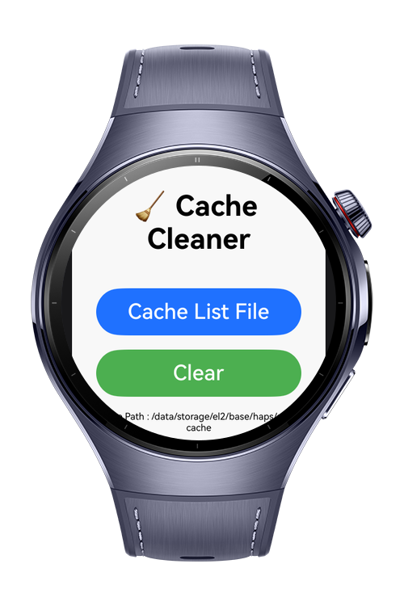

> **Note:** To access all shared projects, get information about environment setup, and view other guides, please visit [Explore-In-HMOS-Wearable Index](https://github.com/Explore-In-HMOS-Wearable/hmos-index).

# ClearWatch

The ClearWatch app provides real-time CPU performance monitoring along with the ability to scan and clean application
cache files on HarmonyOS wearable devices.
The purpose is to help users optimize system performance, free storage, and visualize CPU activity through intuitive
charts.

# Preview

<div>
  
  
  
  
</div>
# Use Cases
With this application, you can access the clock's memory usage and CPU values. You can see them visually with a graph. On the last page, you can access and clear the catches within the application.

# Tech Stack

- **Languages**: ArkTS, ArkUI
- **Frameworks**: HarmonyOS 5.1.0(18)
- **Tools**: DevEco Studio Vers 5.1.0.828SP1,
- **Libraries**: @kit.ArkUI, @kit.AbilityKit,@kit.PerformanceAnalysisKit,@visactor/harmony-vchart,@ohos/lottie

# Directory Structure

```
├───common
│       animation.json
│
├───entryability
│       EntryAbility.ets
│
├───entrybackupability
│       EntryBackupAbility.ets
│
├───model
│       Cpu.ets
│
├───pages
│       ClearWatch.ets
│       Dashboard.ets
│       Graph.ets
│       Index.ets
│       SplashScreen.ets
│
├───service
│       FileCleanerService.ets
│
├───util
│       CpuHelper.ets
│
└───viewmodel
        ClearWatchViewModel.ets
        CpuViewModel.ets

```

# Constraints and Restrictions

## Suported Devices

- Huawei Watch 5

## Limitations

- ClearWatch is not working on previewer or simulators

# License

**ClearWatch** is distributed under the terms of the MIT License
See the [LICENSE](../../Downloads/LICENSE) for more information.
